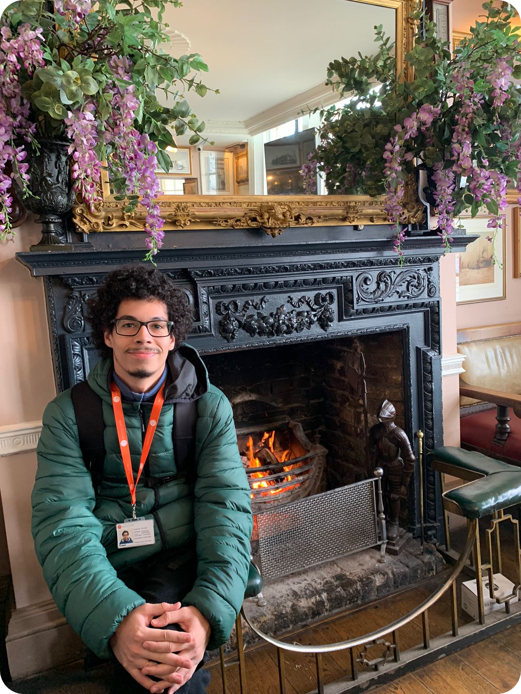

<h1 align="center"><b>Thomas dos Santos Palma</h1></b>

 
   

## **Introdução**

Olá, meu nome é Thomas Palma. Sou técnico em Desenvolvimento de Sistemas, formado pela Etec Machado de Assis, em Caçapava. Também sou graduado em Análise e Desenvolvimento de Sistemas pela Fatec Prof. Jessen Vidal, em São José dos Campos. Tenho grande interesse na área de DevOps e já estou me familiarizando com tecnologias relacionadas a esse campo para o desenvolvimento e gerenciamento de sistemas.

## **Formação Acadêmica**

 > **Técnico em Desenvolvimento de Sistemas | ETEC Machado de Assis – Caçapava, São Paulo. Conclusão: 2019.**

 
Durante a trajetória do meu curso técnico em Desenvolvimento de Sistemas, consegui aprimorar minhas Hard Skills. Tive contato com as linguagens de programação Java, PHP e Python. Aprendi também Arduino, Bootstrap, CSS, HTML e SQL. Ao final do curso, precisei desenvolver, em equipe, um Trabalho de Conclusão de Curso (TCC). O projeto consistia em um sistema de gerenciamento para a administração de barbearias, no qual era possível manusear informações pessoais dos clientes, agendar um horário para atendimento, efetuar a compra e o pagamento de serviços e produtos. Como uma opção especial, adicionamos o gerenciamento de fidelidade do cliente.

> **Análise e Desenvolvimento de Sistemas | FATEC Prof. Jessen Vidal – São José dos Campos, São Paulo. Conclusão: julho de 2023.**

No decorrer da minha trajetória no curso de Análise e Desenvolvimento de Sistemas, aprendi que é necessário ser persistente e autodidata. Desde o primeiro semestre, desenvolvemos <b>projetos multidisciplinares</b>, em equipe. A partir destes, utilizamos metodologias ágeis para a sua implementação. A descrição detalhada de cada um desses projetos encontra-se abaixo.

> **Curso de Inglês Internacional | British Study Centres – Londres, Inglaterra. Conclusão: Janeiro de 2023 até Fevereiro de 2023.**

No início de 2023 tive a oportunidade de fazer um intercâmbio de 4 semanas na Inglaterra, onde pude estudar e morar. Foi uma experiência muito enriquecedora, onde aprendi muitas coisas novas e conheci pessoas incríveis. Durante o intercâmbio, tive aulas de inglês com professores experientes e altamente qualificados, o que me permitiu aprimorar meu vocabulário e compreensão do idioma. Além disso, participei de atividades culturais, visitando museus, pontos turísticos e locais históricos, onde pude entender melhor a cultura inglesa e sua magnífica história. Conheci estudantes de diferentes países, por exemplo: Cazaquistão, Japão, Hong Kong e Malásia. O que me deu a oportunidade de fazer novos amigos e aprender sobre suas culturas e tradições. Porém, o intercâmbio foi uma experiência que jamais esquecerei, que me permitiu aprimorar meu inglês e conhecer uma cultura fascinante. Estou muito grato por ter tido esta oportunidade e espero ter a chance de voltar para a Inglaterra um dia.

## **Aprendizagem por Projetos Integrados**
A seguir há uma breve descrição de cada projeto desenvolvido, nos quais eu era um integrante da equipe. Também, há um link dedicado para cada **projeto**:

 - <h4><b>Desenvolvi, em equipe, os seguintes projetos:</h4></b>

   1. [Mr. Academy](https://github.com/ThomasPalma1/portfolio-tg/tree/main/APIs/FatecAPI-01): E-commerce criado com ênfase em vendas de materiais didáticos para estudantes do Ensino Superior de Análise de Sistemas.

   2. [Pantion](https://github.com/ThomasPalma1/portfolio-tg/tree/main/APIs/FatecAPI-02): Website com foco em dashboards para gestão de projetos e acompanhamento de performance dos desenvolvedores responsáveis.

   3. [Ion-X](https://github.com/ThomasPalma1/portfolio-tg/tree/main/APIs/FatecAPI-03): Aplicação Web desenvolvida com o objetivo de realizar a organização dos contatos, a gestão de pipeline, o monitoramento e acompanhamento de clientes.

   4. [TecSoja](https://github.com/ThomasPalma1/portfolio-tg/tree/main/APIs/FatecAPI-04): Aplicação Móvel para efetuar a consolidação de dados e informações sobre o cultivo da soja, viabilizando ao agricultor uma percepção absoluta da produtividade a cada cultivo e produtividade total, além de possibilitar a comparação da produtividade e áreas plantadas nos municípios.

   5. [Alô Cidadão](https://github.com/ThomasPalma1/portfolio-tg/tree/main/APIs/FatecAPI-05): Aplicação Móvel criada utilizando dados públicos, com o propósito de auxiliar a secretaria de obras e serviços públicos.

   6. [MoneyMind](https://github.com/ThomasPalma1/portfolio-tg/tree/main/APIs/FatecAPI-06): Ambiente online criado utilizando dados públicos do Banco Central do Brasil, com o objetivo de efetivar comparação de bancos, produtos, serviços, moedas, taxas, faixa e taxas.

 ## **Carreira Profissional**
 
Sou um profissional com dois anos de experiência na área administrativa industrial. Atualmente, estou adquirindo conhecimento trabalhando no departamento de Desenvolvimento, como estagiário, em uma empresa localizada no parque tecnológico. A empresa em questão viabiliza soluções em mobilidade e gestão urbana.

## **Meus Principais Conhecimentos**
"Com o passar dos semestres, desenvolvi as habilidades nas subsequentes tecnologias. Até a data da última atualização da tabela: 21/06/2023. 
<table>
    <tr>
        <th align="center">Tecnologias</th>
        <th align="center">Básico</th>
        <th align="center">Intermediário</th>
        <th align="center">Avançado</th>
    </tr>
    <tr>
        <td align="center">C</td>
        <td align="center">:heavy_check_mark:</td>
        <td></td>
        <td></td>
    </tr>
    <tr>
        <td align="center">CSS</td>
        <td align="center">:heavy_check_mark:</td>
        <td align="center"></td>
        <td></td>
    </tr>
    <tr>
        <td align="center">Docker</td>
        <td></td>
        <td align="center">:heavy_check_mark:</td>
        <td></td>
    </tr>
    <tr>
        <td align="center">Git</td>
        <td></td>
        <td align="center">:heavy_check_mark:</td>
        <td></td>
    </tr>
    <tr>
        <td align="center">HTML</td>
        <td></td>
        <td align="center">:heavy_check_mark:</td>
        <td></td>
    </tr>
    <tr>
        <td align="center">Java</td>
        <td></td>
        <td align="center">:heavy_check_mark:</td>
        <td></td>
    </tr>
    <tr>
        <td align="center">JavaScript</td>
        <td></td>
        <td align="center">:heavy_check_mark:</td>
        <td></td>
    </tr>
    <tr>
        <td align="center">Linux</td>
        <td></td>
        <td></td>
        <td align="center">:heavy_check_mark:</td>
    </tr>
    <tr>
        <td align="center">Banco de dados relacional</td>
        <td></td>
        <td align="center">:heavy_check_mark:</td>
        <td></td>
    </tr>
    <tr>
        <td align="center">Banco de dados não relacional</td>
        <td align="center">:heavy_check_mark:</td>
        <td></td>
        <td></td>
    </tr>
    <tr>
        <td align="center">Python</td>
        <td></td>
        <td align="center">:heavy_check_mark:</td>
        <td></td>
    </tr>
    <tr>
        <td align="center">React & React Native</td>
        <td align="center">:heavy_check_mark:</td>
        <td></td>
        <td></td>
    </tr>
       <tr>
        <td align="center">Vue</td>
        <td align="center">:heavy_check_mark:</td>
        <td></td>
        <td></td>
    </tr>
</table>
  
## **Minhas Principais Soft Skills**
* **Responsabilidade** 
   - A responsabilidade é uma competência que está presente no meu cotidiano. Ter o compromisso de assumir uma atividade e realiza-lá dentro do prazo combinado é muito importante. Sempre que sinto dificuldade não penso duas vezes antes de solicitar ajuda de alguém com mais conhecimento que eu, visto que atrasar a atividade pode comprometer a entrega.
* **Comunicação**
   - Quando exercemos a comunicação de forma limpa e adequada, tudo encaminha-se para bons resultados. Durante os projetos sempre tentei manter uma boa comunicação com todos os membros da equipe, sempre dando **feedback's** do meu progresso e expressando o meu ponto de vista de forma construtiva para a qualidade do projeto. 

## **Contatos**  
* Para visualizar meus projetos acadêmicos e pessoais, minhas interações e contribuições em repositórios, veja o meu [GitHub](https://github.com/ThomasPalma1)!
* Caso se interesse em visualizar informações pertinentes à minha carreira profissional, na área da tecnologia, acesse o meu [LinkedIn](https://www.linkedin.com/in/thomas-palma-0764b81b3/)!
